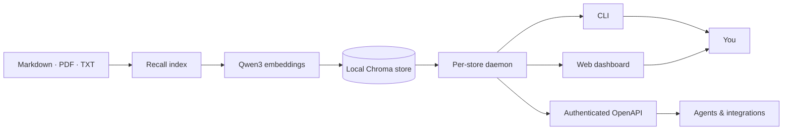

<div align="center">

# Recall

### Your knowledge, locally remembered.

Turn Markdown, PDF, and text files into a private, multilingual knowledge base you can search, question, and connect to other tools.

[](https://www.python.org/)
[](https://nodejs.org/)
[](#local-first-by-design)
[](./docs/GUIDE.md#http-api)

[English](./README.md) · [简体中文](./README.zh-CN.md) · [Guide](./docs/GUIDE.md) · [中文指南](./docs/GUIDE.zh-CN.md)

</div>

---

Recall is a local-first personal knowledge RAG. It runs multilingual embeddings on your machine, stores vectors in Chroma, and uses your chosen model provider only when it needs document metadata or a grounded answer.

```text
Your files → extract → tag → embed locally → search → answer with sources
```

## Why Recall?

<table>
<tr>
<td width="50%"><strong>🔒 Local-first storage</strong><br>Your documents, embeddings, and vector database stay on your machine.</td>
<td width="50%"><strong>🌍 Multilingual retrieval</strong><br>Qwen3 embeddings support multilingual and cross-language search.</td>
</tr>
<tr>
<td><strong>📚 Grounded answers</strong><br>Answers use retrieved evidence by default and include their sources.</td>
<td><strong>🏷️ Automatic organization</strong><br>Indexing can generate a category, tags, and summary for every document.</td>
</tr>
<tr>
<td><strong>⚡ Warm local daemon</strong><br>One daemon per knowledge store keeps Chroma and the embedding model ready.</td>
<td><strong>🔌 Three ways in</strong><br>Use the CLI, the authenticated web dashboard, or the OpenAPI HTTP API.</td>
</tr>
</table>

## Quick start

### 1. Install from source

```bash
git clone https://github.com/SSBun/Recall.git
cd Recall
uv sync
```

Requirements: Python 3.11–3.13, Node.js 22.19+, and [`uv`](https://docs.astral.sh/uv/).

### 2. Connect a model provider

ChatGPT Plus/Pro users can connect with OpenAI Codex OAuth:

```bash
uv run recall provider login openai-codex
uv run recall config
```

You can also use a provider API key through its standard environment variable, such as `OPENAI_API_KEY`.

### 3. Build your knowledge base

```bash
uv run recall index ~/Documents/notes --recursive
```

Recall supports Markdown, plain text, and PDF files. The first indexing or search command downloads `Qwen/Qwen3-Embedding-0.6B` if it is not already cached.

### 4. Search or ask

```bash
uv run recall search "How did we decide to store embeddings?"
uv run recall ask "Summarize our storage decision and cite the sources."
```

### 5. Open the dashboard

```bash
uv run recall dashboard
```

The dashboard provides Search, Ask, and expandable source/chunk metadata previews. It intentionally does not upload or index files.

## One knowledge base, three interfaces



| Interface | Best for | Start here |
|---|---|---|
| CLI | Daily indexing, search, and automation | `recall --help` |
| Dashboard | Interactive search, asking, and source preview | `recall dashboard` |
| HTTP API | MCP servers, agents, and local integrations | `recall dashboard --json` |

## Highlights

- **Idempotent indexing** with stable document IDs and rename detection.
- **Document-level failure isolation** for batch indexing and retagging.
- **Local Qwen3 embeddings** normalized to a fixed 1024-dimensional vector space.
- **Strictly grounded answers by default**; general knowledge requires an explicit flag.
- **Configurable model providers** through environment variables or Recall-owned credentials.
- **ChatGPT Plus/Pro OAuth** through the built-in Pi SDK bridge.
- **Versioned JSON envelopes** for scripts and integrations.
- **Loopback-only API** with Bearer authentication, Host/Origin validation, and no CORS.

## Local-first by design

Recall keeps original files, extracted content, embeddings, metadata, and Chroma data locally. It does **not** read Pi's global credentials or configuration.

When automatic tagging, retagging, or answering uses a hosted model, the required document context is sent to that provider. Use `index --no-tag` when you want indexing to remain fully local, and review your provider's privacy policy before sending sensitive content.

## Documentation

- **[English guide](./docs/GUIDE.md)** — installation, authentication, configuration, CLI, dashboard, API, backups, and troubleshooting
- **[中文完整指南](./docs/GUIDE.zh-CN.md)** — 安装、认证、配置、命令行、Dashboard、API、备份与故障排查
- **[CLI API design](./docs/plans/2026-07-27-recall-cli-api-design.md)** — command and machine-protocol decisions
- **[HTTP API & dashboard plan](./docs/plans/2026-07-29-recall-http-api-dashboard.md)** — server architecture and security boundaries

## Project status

Recall is an early-stage project currently installed from source. The data model and machine envelopes are versioned, but public package distribution and a stable-API guarantee have not been announced yet.

If Recall is useful to you, star the repository and share what you want your personal knowledge system to remember next.
