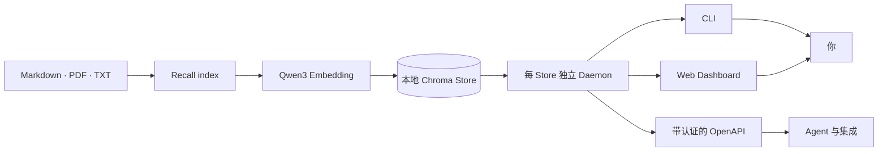

<div align="center">

# Recall

### 让你的知识在本地被记住。

把 Markdown、PDF 和文本文件变成私有的多语言知识库，随时检索、提问，并连接其他工具。

[](https://www.python.org/)
[](https://nodejs.org/)
[](#本地优先)
[](./docs/GUIDE.zh-CN.md#http-api)
[](./LICENSE)

[English](./README.md) · [简体中文](./README.zh-CN.md) · [English Guide](./docs/GUIDE.md) · [中文指南](./docs/GUIDE.zh-CN.md)

</div>

---

Recall 是一个本地优先的个人知识 RAG。它在本机运行多语言嵌入、使用 Chroma 保存向量，仅在生成文档元数据或基于证据回答时调用你选择的模型供应商。

```text
你的文件 → 提取 → 标注 → 本地嵌入 → 检索 → 带来源回答
```

## 为什么选择 Recall？

<table>
<tr>
<td width="50%"><strong>🔒 本地优先存储</strong><br>文档、嵌入和向量数据库都保留在你的机器上。</td>
<td width="50%"><strong>🌍 多语言检索</strong><br>Qwen3 Embedding 支持多语言及跨语言搜索。</td>
</tr>
<tr>
<td><strong>📚 基于证据回答</strong><br>默认只依据检索内容作答，并附上来源。</td>
<td><strong>🏷️ 自动整理</strong><br>索引时可为每篇文档生成分类、标签和摘要。</td>
</tr>
<tr>
<td><strong>⚡ 常驻本地 Daemon</strong><br>每个知识库一个进程，让 Chroma 和嵌入模型保持热启动。</td>
<td><strong>🔌 三种使用方式</strong><br>通过 CLI、带认证的 Web Dashboard 或 OpenAPI HTTP API 使用。</td>
</tr>
</table>

## 快速开始

### 1. 从源码安装

```bash
git clone https://github.com/SSBun/Recall.git
cd Recall
uv sync
```

环境要求：Python 3.11–3.13、Node.js 22.19+ 和 [`uv`](https://docs.astral.sh/uv/)。

### 2. 连接模型供应商

ChatGPT Plus/Pro 用户可通过 OpenAI Codex OAuth 登录：

```bash
uv run recall provider login openai-codex
uv run recall config
```

也可以通过供应商的标准环境变量使用 API Key，例如 `OPENAI_API_KEY`。

### 3. 建立知识库

```bash
uv run recall index ~/Documents/notes --recursive
```

Recall 支持 Markdown、纯文本和 PDF。首次索引或搜索时，如果本地尚未缓存，会下载 `Qwen/Qwen3-Embedding-0.6B`。

### 4. 检索或提问

```bash
uv run recall search "我们如何决定存储嵌入向量？"
uv run recall ask "总结我们的存储决策，并列出来源。"
```

### 5. 打开 Dashboard

```bash
uv run recall dashboard
```

Dashboard 提供 Search、Ask，以及可展开的来源、chunk 和 metadata 预览；它有意不提供文件上传或索引界面。

## 一个知识库，三种入口



| 入口 | 适合场景 | 从这里开始 |
|---|---|---|
| CLI | 日常索引、检索与自动化 | `recall --help` |
| Dashboard | 交互式搜索、提问和来源预览 | `recall dashboard` |
| HTTP API | MCP Server、Agent 和本地集成 | `recall dashboard --json` |

## 主要能力

- **幂等索引**，提供稳定文档 ID 和简单重命名识别。
- **文档级失败隔离**，批量索引或重新标注时单篇失败不影响其他文档。
- **本地 Qwen3 嵌入**，归一化为固定的 1024 维向量空间。
- **默认严格基于知识库回答**，只有显式允许才补充模型常识。
- **可配置模型供应商**，支持环境变量和 Recall 自有凭据文件。
- **ChatGPT Plus/Pro OAuth**，由内置 Pi SDK bridge 提供。
- **版本化 JSON envelope**，便于脚本和集成稳定解析。
- **仅 Loopback 的 API**，使用 Bearer 认证、Host/Origin 校验且不启用 CORS。

## 本地优先

Recall 会把原始文件、提取内容、嵌入、元数据和 Chroma 数据保留在本地，也不会读取 Pi 的全局凭据或配置。

当自动标注、重新标注或回答使用托管模型时，所需的文档上下文会发送给对应供应商。若希望索引过程完全本地化，请使用 `index --no-tag`；处理敏感内容前，请先确认供应商的隐私政策。

## 文档

- **[中文完整指南](./docs/GUIDE.zh-CN.md)** — 安装、认证、配置、CLI、Dashboard、API、备份与故障排查
- **[English guide](./docs/GUIDE.md)** — installation, authentication, configuration, CLI, dashboard, API, backups, and troubleshooting
- **[CLI API 设计](./docs/plans/2026-07-27-recall-cli-api-design.md)** — 命令面与机器协议决策
- **[HTTP API 与 Dashboard 计划](./docs/plans/2026-07-29-recall-http-api-dashboard.md)** — 服务架构与安全边界

## 项目状态

Recall 目前处于早期阶段，暂时从源码安装。数据模型和机器 envelope 已有版本号，但尚未发布公共软件包，也尚未承诺稳定 API。

如果 Recall 对你有帮助，欢迎为仓库点 Star，并分享你希望个人知识系统下一步记住什么。

## 许可证

Recall 使用 [MIT License](./LICENSE) 开源。
